# Full Stack E-Commerce

Full-stack e-commerce application designed to provide a seamless shopping experience. It features user authentication, product listings, and a shopping cart, all built with a robust and scalable tech stack.

## Features

- User Authentication (Sign Up, Sign In, Sign Out)
- Product Listings with detailed views
- Shopping Cart functionality (With guest Cart)
- Responsive design
- Payment Gateway (razorpay)
- Admin Panel (CRUD operations for products and Users)
- Dynamic Search, Sort, and Filter product/users/orders
- Pagination for products/users/orders

## Screenshots - I Can't keeep this website up for long : )


<div align="center">

<details open>
<summary><b>User Journey</b></summary>

<div style="max-width: 800px; margin: 0 auto;">

<table>
<tr>
<td align="center">
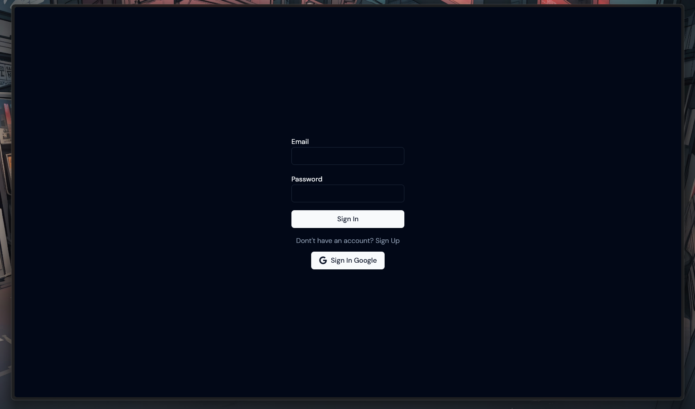
<p><em>Secure User Authentication with Email & Google Sign-In</em></p>
</td>
</tr>
</table>

<table>
<tr>
<td align="center">

<p><em>Product Showcase with Categories and Featured Items</em></p>
</td>
</tr>
</table>

<table>
<tr>
<td align="center">
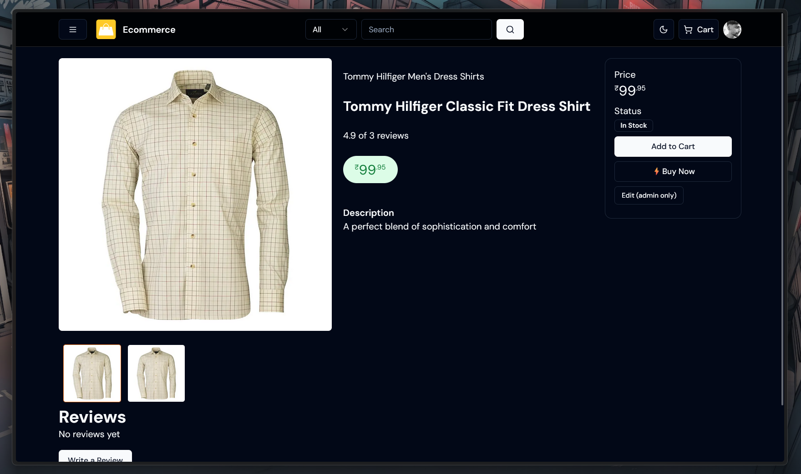
<p><em>Detailed Product Information with Images and Specifications</em></p>
</td>
</tr>
</table>

<table>
<tr>
<td align="center">

<p><em>User-Friendly Cart with Quantity Controls and Price Breakdown</em></p>
</td>
</tr>
</table>

<table>
<tr>
<td align="center">
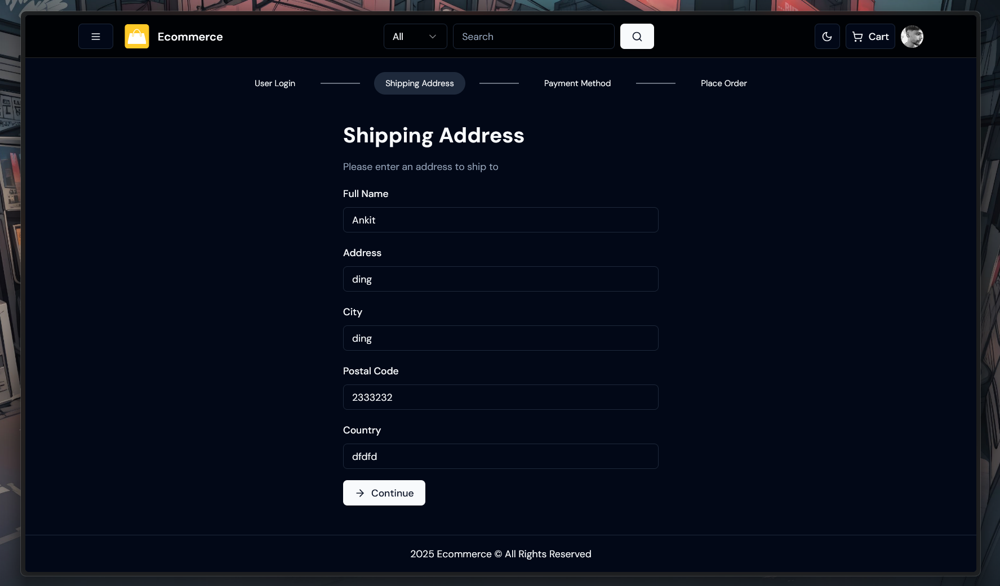
<p><em>Simple Address Collection for Shipping</em></p>
</td>
</tr>
</table>

<table>
<tr>
<td align="center">
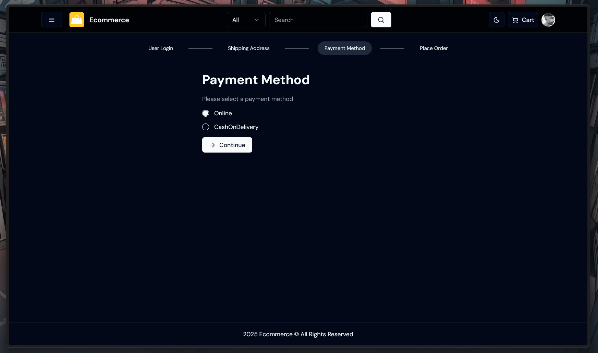
<p><em>Multiple Payment Options for Customer Convenience</em></p>
</td>
</tr>
</table>

<table>
<tr>
<td align="center">
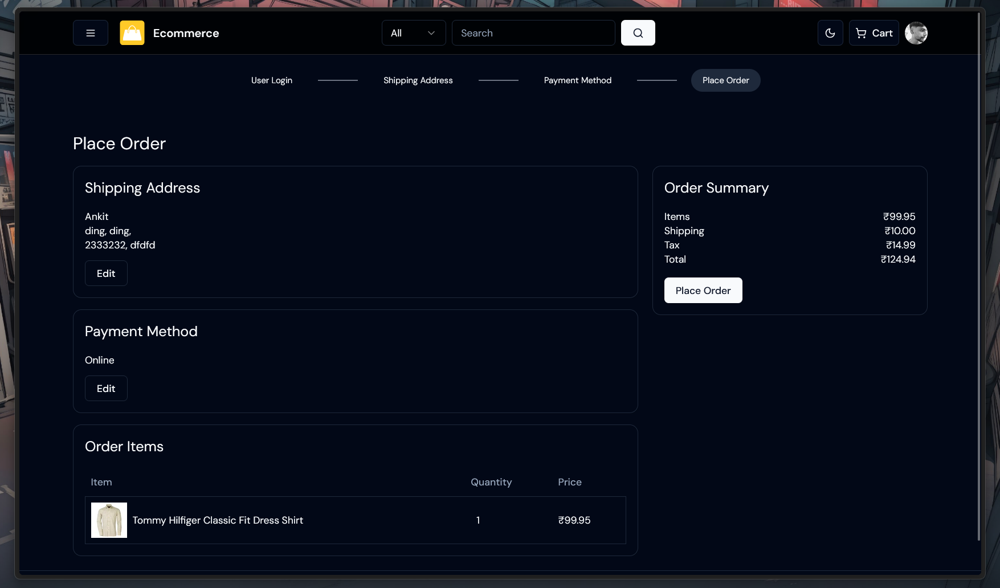
<p><em>Order Summary Before Final Confirmation</em></p>
</td>
</tr>
</table>

<table>
<tr>
<td align="center">
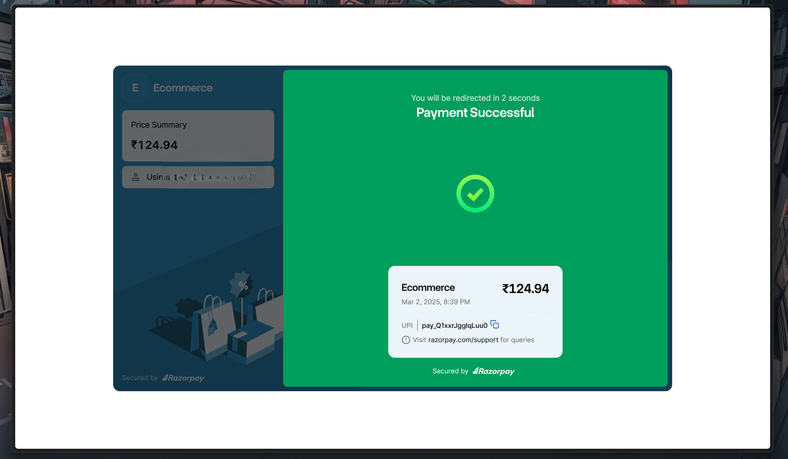
<p><em>Secure Payment Processing with Razorpay</em></p>
</td>
</tr>
</table>

<table>
<tr>
<td align="center">
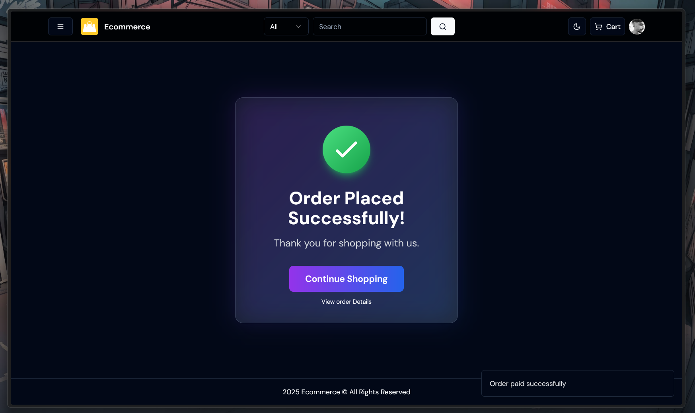
<p><em>Order Confirmation with Success Message</em></p>
</td>
</tr>
</table>

<table>
<tr>
<td align="center">
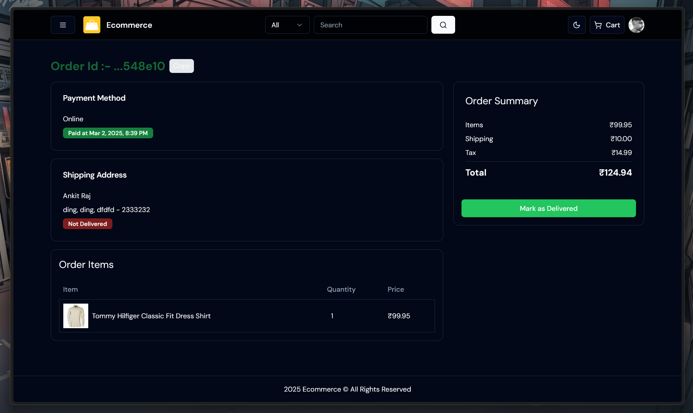
<p><em>Complete Order Information and Tracking</em></p>
</td>
</tr>
</table>

</div>
</details>

<details>
<summary><b>Admin Dashboard</b></summary>

<div style="max-width: 800px; margin: 0 auto;">

<table>
<tr>
<td align="center">
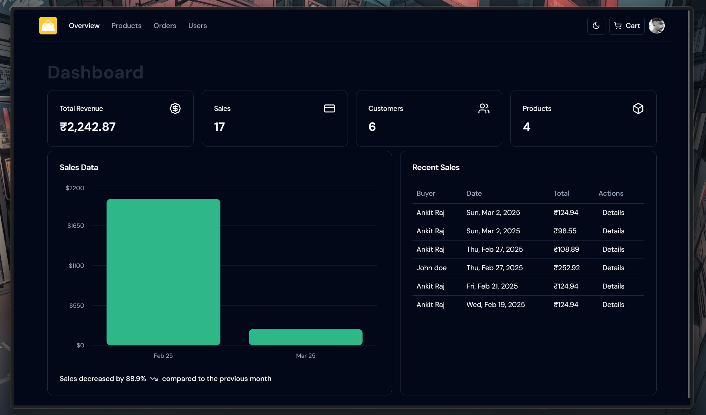
<p><em>Comprehensive Admin Dashboard with Sales Analytics</em></p>
</td>
</tr>
</table>

<table>
<tr>
<td align="center">
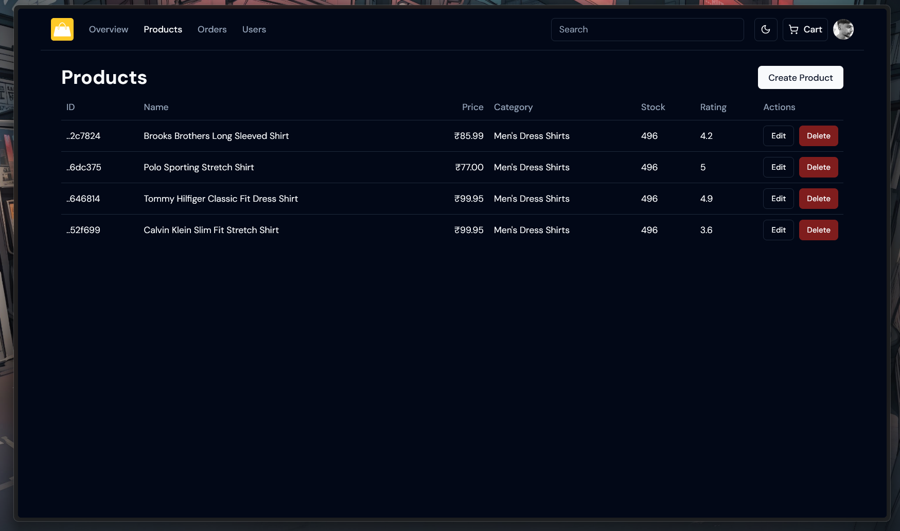
<p><em>Complete Product Management with CRUD Operations</em></p>
</td>
</tr>
</table>

<table>
<tr>
<td align="center">
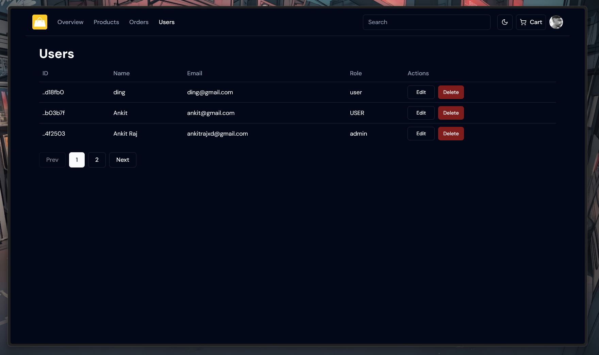
<p><em>User Management with Role-Based Access Control</em></p>
</td>
</tr>
</table>

</div>
</details>

<details>
<summary><b>Search Functionality</b></summary>

<div style="max-width: 800px; margin: 0 auto;">

<table>
<tr>
<td align="center">
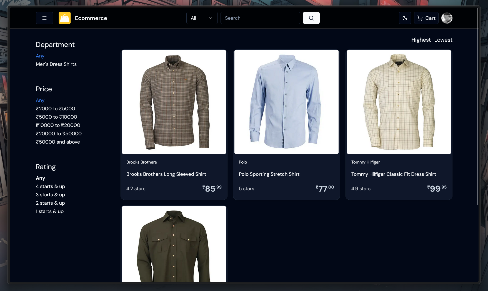
<p><em>Dynamic Search with Filters and Sorting Options</em></p>
</td>
</tr>
</table>

</div>
</details>

</div>

## Tech Stack

### Frontend

- **Next.js**: A React framework for server-side rendering and generating static websites.
- **React**: A JavaScript library for building user interfaces.
- **Tailwind CSS**: A utility-first CSS framework for rapid UI development.
- **ShadCn UI**: A set of accessible, unstyled UI components for building high-quality design systems and web apps.
- **Lucide Icons**: A collection of simple and consistent icons.

### Backend

- **Auth.js**: Authentication for Next.js applications.
- **Prisma**: An ORM for Node.js and TypeScript.
- **Neon**: A serverless PostgreSQL database.
- **uploadthingy**: A file uploader for Node.js.

### Other Tools

- **TypeScript**: A strongly typed programming language that builds on JavaScript.
- **ESLint**: A tool for identifying and fixing problems in JavaScript code.
- **PostCSS**: A tool for transforming CSS with JavaScript plugins.
- **Zod**: A TypeScript-first schema declaration and validation library.

# Getting Started

### Prerequisites

- Node.js
- npm
- PostgreSQL database (Vercel neon)

### Installation

1. Clone the repository:

   ```bash
   git clone https://github.com/ankitrajxd/e-commerce.git
   ```

2. Install dependencies:

   ```bash
   npm install or npm install --legacy-peer-deps
   ```

3. Create a `.env` file in the root directory and add the following environment variables:

   ```bash
   NEXT_PUBLIC_APP_NAME = 'Ecommerce'
   NEXT_PUBLIC_APP_DESCRIPTION = 'Modern Ecommerce store'
   NEXT_PUBLIC_SERVER_URL= 'http://localhost:3000'
   DATABASE_URL='db url'

   # auth
   AUTH_SECRET="random generated string"
   NEXTAUTH_URL="http://localhost:3000"
   NEXTAUTH_URL_INTERNAL="http://localhost:3000"

   PAYMENT_METHODS="Online,CashOnDelivery"
   DEFAULT_PAYMENT_METHOD="Online"


   #  razorpay
   RZR_KEY_ID=''
   NEXT_PUBLIC_KEY_ID=''
   RZR_KEY_SECRET=''


   # google oauth - https://console.cloud.google.com/ - for authjs
   AUTH_GOOGLE_ID=''
   AUTH_GOOGLE_SECRET=''


   # uploadthing -  for uploading files
   UPLOADTHING_TOKEN=''
   UPLOADTHING_SECRET=''
   UPLOADTHING_APP_ID='' # get for the url
   ```

4. Run database migrations:

   ```bash
   npx prisma migrate dev
   ```

5. Seed the db (Make sure the code is uncommented. It is commented to avoid seeding the db every time the server starts):

   ```bash
   npx tsx ./db/seed
   ```

6. Start the development server:

   ```bash
   npm run dev
   ```

## Contributing

Contributions are welcome! Please open an issue or submit a pull request for any changes.

## License

This project is licensed under the MIT License.
